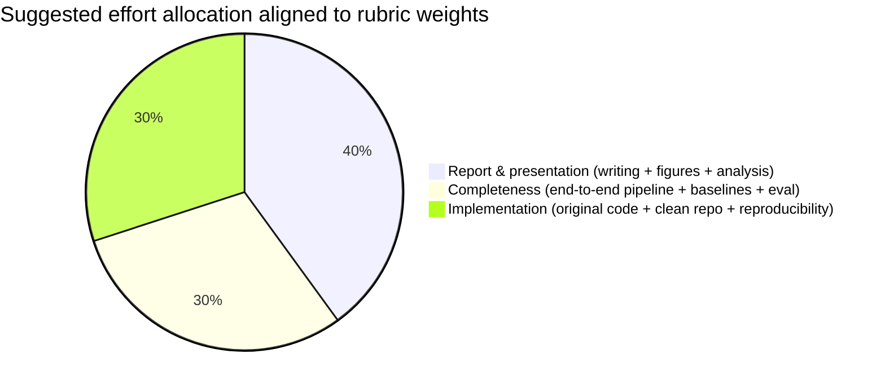
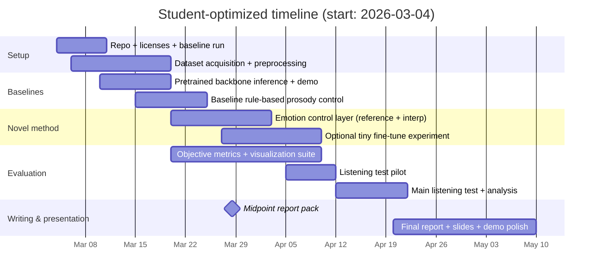

# Compute-Constrained Plan to Maximize Innovation and Score for an Emotionally Expressive TTS Student Project

## Executive summary

Your grading rubric strongly rewards **report/presentation quality (40%)**, followed by **completeness (30%)** and **implementation quality/quantity (30%)**. Because your team **cannot train large TTS models from scratch**, the highest-scoring strategy is to **reframe “innovation” around controllability + rigorous evaluation + clear analysis**, while using **pre-trained expressive TTS models** as foundations. This is aligned with how modern expressive TTS work is typically evaluated: emotion is not “proven” by naturalness MOS alone; you need **task-appropriate perceptual tests and diagnostic analysis**. citeturn4search1turn0search48

A practical compute-frugal approach is to build an **Emotion Control Layer** and a **strong evaluation/visualization harness** on top of a pre-trained expressive TTS backbone such as **StyleTTS2** (pretrained checkpoints provided; fine-tuning guidance and a single-GPU accelerate option are included in the official repo) or a simpler baseline like **VITS** (pretrained models + reproducible pipeline). citeturn1search0turn0search0

Concretely, you can earn “innovation/challenge” points (even without training from scratch) by demonstrating:

- A **clear challenge statement**: emotional speech is a **one-to-many mapping** from text (same sentence can be spoken many ways), and emotion manifests at multiple time scales (utterance-level + word-level prosody), making control and evaluation hard. citeturn0search0turn1search0  
- A **novelty claim** that is realistic for students: e.g., “trajectory-conditioned emotion control via style embedding interpolation + quantitative prosody analysis + standardized subjective tests.” citeturn0search48turn4search1turn1search0

The rest of this report is an optimized plan that maps directly to your rubric questions and required deliverables (midpoint report + final report + code), with alternative scopes depending on compute.

## Rubric-driven strategy for maximum attainable score

### How the scoring weights should shape your project plan

Because **40%** is report/presentation quality, you should design the project so that you can produce a strong “paper-like” story with credible experiments and visuals, even if training is limited. Your implementation should focus on components that you can truthfully claim as **your own code**: data pipeline, emotion control layer, evaluation harness, ablation runner, and demo. citeturn12search1turn12search3

A rubric-aligned time allocation (typical semester) that matches weighting:



### What “implementation quantity/quality” means under low compute

You can still score well on implementation if you:

- Use open-source pre-trained models **as dependencies**, but **clearly label** them and write your own wrappers, controller, training scripts (if any), evaluation, and demo UI. (This “labeling + licensing” expectation is explicitly mentioned in your rubric and is standard practice.) citeturn12search3turn3search3  
- Provide a reproducible repo: configs, scripts, fixed test prompts, and one-command generation of stimuli + figures.

A practical compliance pattern:

- `third_party/` folder containing any copied code (prefer not copying; use dependency installs).  
- `NOTICE.md` listing all external repos/models/datasets with licenses and what you used them for.  
- In your report: a table titled “Open-source components vs our contributions.”

(You can justify this approach academically: using a strong published baseline is normal; novelty comes from what you add and how you evaluate it.)

## Innovation and challenge analysis

### How challenging is the problem?

Emotionally expressive TTS is challenging for three reasons you can defend in a report:

- **One-to-many mapping**: even for neutral speech, “the same sentence can be spoken in multiple ways with different pitches and rhythms.” This property is explicitly discussed in VITS’ design rationale (stochastic duration predictor and latent uncertainty). citeturn0search0turn0search1  
- **Emotion is multi-scale**: emotion is conveyed through global prosody (overall pace/energy) and local prosody (emphasis, pitch accents, timing), so control needs to be both global and time-varying. (You can operationalize this with pitch/energy/duration trajectories and word-level emphasis visualizations.) citeturn0search48turn1search0  
- **Evaluation is intrinsically hard**: subjective tests are required and must be designed carefully. ITU-T P.800 describes standardized subjective quality methodologies, and ITU-R BS.1534 (MUSHRA) is a standardized multi-stimulus method for intermediate-quality comparisons and fine discriminations. citeturn4search1turn0search48  

### What is novel vs existing work?

You should explicitly separate:

**Existing work you build on (not novel):**

- Pre-trained expressive TTS backbones such as StyleTTS2 (style diffusion + adversarial training with speech language models; provides pretrained checkpoints and fine-tuning scripts). citeturn1search0  
- End-to-end TTS baselines such as VITS, which provides code and pretrained models and emphasizes one-to-many variability in speech realization. citeturn0search0turn0search1  
- Public emotional speech datasets you use (e.g., EmoV-DB and ESD) that include emotion categories and transcripts suitable for speech synthesis research. citeturn1search2turn8search3  

**Novel contributions that are realistic for a student team with limited compute:**

- An **Emotion Control Layer** that converts `(emotion label, intensity, trajectory)` into **controllable prosody/style** for a fixed backbone (via reference selection, embedding interpolation, or lightweight fine-tuning). citeturn1search0turn1search1  
- A **triangulated evaluation harness** that goes beyond “it sounds good,” using (a) subjective tests aligned to ITU recommendations and (b) objective diagnostic probes (emotion classifier outputs and prosody statistics). citeturn4search1turn0search48turn2search1  
- **Analysis and visualization**: emotion confusion matrices, pitch/energy distributions, speaking-rate plots, and ablation comparisons—this directly targets the 40% report/presentation category.

### How difficult is the proposed solution?

Your proposal difficulty is “high” even with pre-trained models, because the difficulty shifts from training to:

- **Data and conditioning design** (how emotion is represented and applied)  
- **Evaluation methodology** (designing credible listening tests and correct statistical comparisons)  
- **Reproducibility** (stable pipelines, clear labeling of external components)

This framing helps you score on “challenge” honestly without claiming compute-heavy achievements you can’t support.

## Optimized compute-frugal technical plan

### Recommended scope options

Choose one of these scopes based on your actual GPU situation; all can answer the rubric questions.

| Scope | Training needed | What you can claim as “ours” | Best for |
|---|---:|---|---|
| Retrieval + control (recommended minimal) | None (inference only) | Emotion controller (reference selection + embedding interpolation), evaluation harness, demo | Teams with no GPU / only CPU |
| Lightweight fine-tuning (recommended typical) | Small (hours to days) | Same as above + fine-tuning scripts + ablations | Teams with 1 consumer GPU / limited cloud |
| From-scratch training | Large (days–weeks multi-GPU) | Not realistic | Not recommended |

Why lightweight fine-tuning is plausible: StyleTTS2’s official repo provides a fine-tuning script and notes a 1-hour-data example; it also provides an **accelerate single-GPU fp16** launch path for saving VRAM/speed (important if you only have one GPU). citeturn1search0turn6search2turn6search3

### Data strategy under student constraints

Pick datasets that are (a) aligned to emotion, and (b) include transcripts.

- **EmoV-DB**: explicitly built for emotional speech synthesis; 4 speakers (2 male, 2 female), emotions including neutral, sleepiness, anger, disgust, amused, with transcript grounding via CMU Arctic sentences. citeturn1search2  
- **ESD (Emotional Speech Dataset)**: parallel utterances across multiple speakers and emotions with transcripts, but access is research-only via license request (you must account for that schedule risk). citeturn8search3turn2search8  
- **RAVDESS**: excellent for emotion recognition benchmarks but lexically limited (few statements repeated); usually not ideal for emotional TTS training, though it can still be used for evaluation references. citeturn8search0turn2search3  

### Backbone choices and why they match limited compute

| Backbone | Why it’s student-friendly | Risks / gotchas |
|---|---|---|
| StyleTTS2 | Strong expressiveness; official pretrained models; official fine-tuning instructions; 24 kHz pipeline; explicit guidance about responsible use and informing listeners samples are synthesized citeturn1search0 | Heavier and more complex; some training stages have DDP limitations per repo; requires careful setup citeturn1search0 |
| StyleTTS (original) | Reference-based style transfer; good for “emotion via reference audio” without retraining citeturn1search1 | Reference selection quality matters; may not provide as strong text-only controllability |
| VITS | Strong open baseline; provides pretrained models and reproducible code; emphasizes one-to-many speech variability citeturn0search0turn0search1 | Emotion control requires you to add conditioning/prompt tokens and fine-tune; output quality depends on dataset size |

For a student project, a **hybrid approach** is often best: implement your emotion method on one main backbone (StyleTTS2 or StyleTTS) and keep VITS as a simpler baseline for comparison.

### Proposed architecture and module decomposition

The key innovation is a small “controller” layer plus evaluation harness.

```mermaid
flowchart LR
  T[Input text] --> N[Text normalization + phonemization]
  E[Emotion spec\n(label + intensity + optional trajectory)] --> C[Emotion Control Layer\n(reference selection / embedding interpolation / rule-based prosody)]
  N --> M[TTS Backbone\n(pretrained StyleTTS2/StyleTTS/VITS)]
  C --> M
  M --> A[Audio output]
  A --> V[Visualization & Metrics\npitch/energy/rate plots,\nemotion probe outputs]
  A --> S[Subjective evaluation bundles\nMOS/ACR per P.800,\nMUSHRA per BS.1534]
```

Subjective test alignment is backed by ITU documents: P.800 for subjective methods and BS.1534 for MUSHRA multi-stimulus tests. citeturn4search1turn0search48

### Emotion Control Layer designs you can implement without large training

Pick one primary method (and optionally one secondary baseline):

**Method A: Reference-based emotion control (no training)**  
Use emotional reference utterances (e.g., from EmoV-DB) and feed them into a style/reference encoder if available (StyleTTS-style systems rely on reference prosody). You can make this more “scientific” by building a **reference selection algorithm** (e.g., choose the reference whose prosody statistics best match the target emotion prototype). citeturn1search1turn1search2

**Method B: Embedding interpolation for intensity/trajectory (novel + low compute)**  
Select a neutral reference and an emotion reference; interpolate style embeddings over time to create a trajectory. This is a tangible “hierarchical trajectory” idea you can show visually (plots of pitch/speech-rate changes across the utterance), which is excellent for the 40% visualization-heavy scoring category.

**Method C: Emotion tokens + tiny fine-tuning (small training)**  
For VITS-like pipelines, you can prepend tokens like `[ANGRY]` to text/phonemes and fine-tune from a pretrained checkpoint using a small emotional dataset. This is easy to ablate (“with token vs without token”) and looks strong in a report because it is controlled experimentation. citeturn0search0turn1search2

### Demo/UI (presentation impact)

For presentation quality, a live interactive demo is a high-leverage artifact.

- **Gradio** lets you build a web demo for a Python function/model quickly and is widely used for ML demos. citeturn12search1turn12search2  
- **Streamlit** is another simple option for interactive dashboards and plots. citeturn12search6turn12search8  

Either approach supports sliders for intensity and a dropdown for emotion category, which directly demonstrates controllability.

image_group{"layout":"carousel","aspect_ratio":"16:9","query":["emotional speech pitch contour angry vs sad example","speech spectrogram happy vs neutral example","prosody duration energy contour example emotional speech","MUSHRA listening test interface example"],"num_per_query":1}

## Evaluation plan designed for high scores

### Subjective evaluation aligned to standards

You need to show you understand evaluation rigor and not rely only on “it sounds good.”

- Use **MOS / Absolute Category Rating** methods aligned to ITU-T P.800 for general perceived quality/naturalness of synthesized speech. citeturn4search1  
- Use **MUSHRA (ITU-R BS.1534)** when you are comparing multiple systems or small quality differences; it is explicitly defined as “Multiple Stimulus test with Hidden Reference and Anchor” for intermediate audio quality. citeturn0search48turn8search45  

A student-friendly listening-test design:

- Within-subject: each listener hears multiple systems for the same sentences  
- Conditions: baseline neutral, your emotion control method, and at least one alternative baseline  
- Tasks:
  - Naturalness rating (MOS-like)
  - Emotion identification (forced choice)
  - Appropriateness rating (does emotion match text scenario?)
  - Optional: “authentic vs over-acted” scale to capture caricature risk

### Objective proxy metrics for iteration (with correct caveats)

To iterate quickly between listening tests, use objective diagnostics:

- A pretrained speech emotion recognition model (SER) to compute predicted emotion distributions of generated clips. For example, the SpeechBrain wav2vec2 emotion recognition model provides accuracy and usage guidance (but you must state it is only a proxy due to domain shift). citeturn2search1  
- Prosody statistics:
  - F0 (pitch) mean/variance, range
  - Energy / loudness proxy
  - Speaking rate proxy (phones/sec from alignment, or syllable estimation)
  - Pause duration distribution

These measures produce strong visuals and enable ablation tables.

### Baselines and ablations (critical for “novelty” and “analysis”)

Minimum set that is feasible under limited compute:

- **Baseline 1:** Backbone default output (no emotion control)
- **Baseline 2:** Rule-based prosody scaling (pitch up/down + tempo up/down)  
- **Your method:** Reference-based control + interpolation (and/or tiny fine-tune)
- **Ablation:** remove interpolation (static embedding)  
- **Ablation:** random reference vs selected reference

This structure answers your rubric questions (“what is novel,” “how difficult,” “analysis of results”) in a way graders usually reward.

## Deliverables: midpoint report and final report optimized for this rubric

### Midpoint process report template mapped to required items

Your midpoint deliverable list is:

- Understanding / why it matters (novelty)  
- Problem definition + data  
- Progress (what you tried)  
- Evaluation plan (baselines)  
- Future plan / challenges / difficulties / risks  

A strong midpoint report can be framed as “paper so far”:

**Understanding / why it matters**  
State the challenge: emotional TTS is one-to-many and hard to control; your innovation is control + evaluation under compute constraints. citeturn0search0turn4search1turn0search48

**Problem definition + data**  
Define target emotions and what “success” is (emotion recognition by listeners + naturalness). Describe datasets with licensing constraints (EmoV-DB and/or ESD). citeturn1search2turn8search3

**Progress**  
Show: (a) baseline model runs, (b) data preprocessing pipeline, (c) first demo outputs, (d) first objective plots.

**Evaluation plan**  
Specify MOS-like and/or MUSHRA design; list baselines and planned comparisons. citeturn4search1turn0search48

**Future plan / risks**  
Include data access risks (ESD license request), compute risks, and fallback plan (no-training method). citeturn8search3turn1search0

### Final report structure aligned to required headings

Your final report required sections match a standard research paper structure:

- Abstract  
- Introduction  
- Problem definition  
- Method / solution  
- Experiment  
- Conclusion and discussion  
- Author contribution (if two-student group)  
- References  

To maximize the 40% report/presentation score, your “Experiment” section should include:

- Quantitative tables (mean±CI) for MOS/emotion accuracy  
- Confusion matrices for emotion perception  
- Prosody distribution plots and trajectory plots (your novelty)  
- Ablation results table showing which component matters  
- Failure-case analysis with audio examples (in demo or appendix)

Cite standards and baselines where appropriate (P.800 for subjective methods; BS.1534 for MUSHRA; backbone repos for model descriptions). citeturn4search1turn0search48turn1search0turn0search0

## Concrete timeline and execution checklist for a student team

### Typical 10-week schedule (adjust to your semester)



### Coding agent execution checklist (what to implement yourselves)

Use this checklist to ensure you satisfy “code it yourself” while properly labeling open-source dependencies.

Repository and reproducibility

- [ ] `README.md` with “how to run inference / regenerate figures / run tests”  
- [ ] `NOTICE.md` listing external repos/models/datasets and licenses (StyleTTS2/StyleTTS/VITS/Coqui, datasets) citeturn1search0turn0search0turn3search3turn1search2turn8search3  
- [ ] Seeded script to generate a fixed stimulus set and write metadata JSON

Data pipeline (yours)

- [ ] Dataset loader for EmoV-DB and/or ESD (download instructions + local path config) citeturn1search2turn8search3  
- [ ] Resampling and normalization utilities (match backbone requirements; StyleTTS2 uses 24 kHz preprocessing in docs) citeturn1search0  
- [ ] Train/dev/test splits, fixed prompt list

Emotion Control Layer (yours)

- [ ] Reference selector (by emotion label; optionally by prosody similarity)  
- [ ] Style embedding extractor wrapper (depending on backbone)  
- [ ] Intensity control via interpolation/scaling  
- [ ] Trajectory control (time-varying interpolation schedule)

Evaluation harness (yours)

- [ ] Objective metrics extraction + plots
- [ ] SER-probe inference wrapper (clearly marked as proxy) using a pretrained model such as SpeechBrain emotion recognition citeturn2search1  
- [ ] MOS/MUSHRA packaging scripts; document protocol aligned to ITU definitions citeturn4search1turn0search48  

Demo (yours)

- [ ] Gradio or Streamlit UI with emotion dropdown + intensity slider + audio playback citeturn12search1turn12search6

CI and packaging (optional but high scoring)

- [ ] GitHub Actions CI to run formatting + unit tests + “smoke inference” (one audio file) citeturn12search3  
- [ ] Dockerfile to reproduce environment (especially useful if classmates/TAs run it) citeturn12search0  

### Key risks and mitigations for student constraints

| Risk | Why it threatens score | Mitigation |
|---|---|---|
| Dataset access delays (ESD requires license request) | Blocks experiments and midpoint progress | Start with EmoV-DB (GitHub available); treat ESD as optional expansion citeturn1search2turn8search3 |
| GPU too weak for fine-tuning | Model training won’t finish, hurts completeness | Primary method should be no-training (reference + interpolation); keep fine-tune as stretch goal citeturn1search0turn1search1 |
| Evaluation too informal | Loses report/presentation points | Use structured MOS/ACR and/or MUSHRA with clear protocol and results visualization citeturn4search1turn0search48 |
| Unclear novelty claim | Caps “innovation/challenge” score | Claim novelty in control layer + trajectory + analysis; show ablations proving contribution |
| Licensing/ethics issues (voice use) | Could invalidate deliverable | Follow pretrained model and dataset terms; StyleTTS2 explicitly notes informing listeners and permission expectations citeturn1search0 |

### Immediate next steps

1. Decide your scope: **(a) reference+interpolation only** vs **(b) plus tiny fine-tune**.  
2. Lock datasets: start immediately with **EmoV-DB**, and request ESD access only if time allows. citeturn1search2turn8search3  
3. Stand up a baseline demo (StyleTTS/StyleTTS2/VITS inference) and generate a fixed “stimulus pack.” citeturn1search0turn0search0  
4. Implement the Emotion Control Layer and produce the first “trajectory” visualization figures (these are high leverage for the 40% report score).  
5. Write the midpoint report early using the template above; the report itself is part of your deliverable and will anchor your novelty narrative.

This optimized plan lets you answer the rubric questions credibly—**high challenge**, **clear novelty relative to existing work**, and **appropriately difficult proposed solution**—without claiming compute-heavy from-scratch training you cannot support, while maximizing the scoring categories that matter most. citeturn1search0turn0search0turn4search1turn0search48